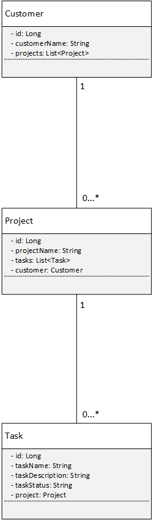

## AG Task Manager
Desafio técnico para a vaga de desenvolvedor fullstack java + vuejs no grupo AG Capital.

A aplicação estará rodando no endereço: http://localhost:9000/
 
 
**Tecnologias utilizadas**
 

    Java e spring boot para o backend
    Liquibase para realizar a migration do banco de dados
    Vue.js e quasar para o frontend
    PostgreSQL para o banco de dados
    Docker para facilitar na hora de rodar a aplicação

**Setup do projeto**
 
 
Requisitos:

    Docker
 
Na pasta raiz, onde se encontra o docker-compose.yaml, rodar o comando:
 
 

    docker compose up -d
    
Isso criará as imagens do banco de dados postgres, do backend e do frontend, e subirá tudo junto em um compose, fazendo o sistema ser acessível através da url http://localhost:9000/
    
  
 
Para rodar os testes unitários localmente, é necessário trocar a url do banco no application.yml de:
 
 

      jdbc:postgresql://database:5432/taskmanager
para:

      jdbc:postgresql://localhost:5432/taskmanager
    
 
Diagrama de classes:
 
 

 
 
**Pontos de melhoria e observações**
 
Gostaria de ter tido mais tempo para implementar duas novas entidades: Squad e User, para atribuir um projeto à um squad além de um cliente, e também para atribuir uma task a um user, ao invés de atribuir apenas à um projeto.
